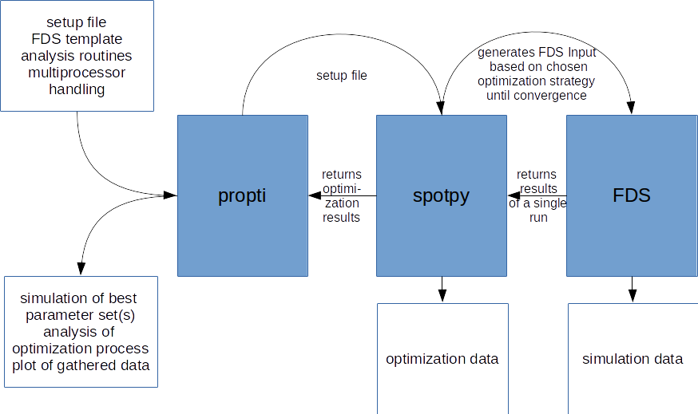

## Process

## Idea

Propti (working title) is an interface tool that couples FDS (https://github.com/firemodels/fds) with spotpy (https://github.com/thouska/spotpy/) to solve the inverse problem of material parameter estimation in a modular way. propti covers setting up the general framework of the process as well as the preprocessing, e.g. generating FDS input files from (provided or self-made) templates and handing them to spotpy, and the postprocessing, e.g. analysing the evaluations of spotpy, find the best solution, run the best fitting parameters and plot all the data in nice figures.

The benefits of this universal interface tool are a standardized and convenient way to solve the inverse problem of material parameter optimization with all available options in FDS (pyrolysis model, gas phase reaction, tga mode, use results in real scale simulation, etc...) and spotpy (several optimization strategies, sensitivity analysis, parallelization, etc...), accompanied with template simulation set ups, benchmark database, reference input files, modeling and experimental guides.

## Features

- coupling of FDS and spotpy
- automatized pre- and postprocessing
- well documented
- parallelizable (MPI, OpenMP, multiprocessing)
- templates and reference input files
- suitable for HPC use
    - stop and restart processes
    - ...
- guide for optimization (including experimental design?)
- database for results and experimental data (later ?)
- benchmark database (later ?)
- provide a platform to discuss modeling the problem
- ...

## Goals

### short term goals

- find new name
- implement framework and pre- and postprocessingfeatures
- provide templates and reference model designs
- provide a reliable base for propti by getting more involved in spotpy development and maintenance

### mid term goals

- evaluate simulation templates and reference input files
- imporve propti
- make propti publicly available

### long term goals

- promote use of propti

## ToDo

1. find a better name
2. collect currently used templates, strategies and code snippets
3. collect and evaluate requirements and needed features
4. define process and boundarys
6. define features
6. evaluate current templates, strategies and code snippets for reuse
6. implement
7. test
8. validate
8. use
9. evaluate
10. imporve
11. goto 'use'test

## Workplan

20.06.2017 - 14.07.2017
1. Collect resources that could be useful and evaluate them. Put them in  
the resources repository. Tristans scripts could provide a great basis  
for our work, as they are written in a neat and modular way and are  
documented at least adequate.

03.07.2017 - 17.07.2017
2. Based on that, we should collect and discuss the (individually) 
needed features, requirements and ideas. For that part, we could use 
both, gitlab, and a collaborative mind map (I'm searching for one at the 
moment, suggestions welcome)

17.07.2017 - 28.07.2017
3. After evaluating 2., we have to define our process, the system 
boundaries and the requirements, that the software has to fulfil.

31.07.2017 - 04.08.2017
4. With 3. done, we can build a working plan, to put all the work that 
has to be done in work packages and assign it to someone

14.08.2017 - XX.09.2017
5. To implement what has been determined in 3., we will meet and 
implement the biggest parts in a few days, (maybe from 14.08.-18.08. in 
Wuppertal?)

XX.09.2017 - ...
6. circle of test, validate, use, evaluate, improve

## Workshop

Date: 14.08. - 17.08. (tbc)
Place: Wuppertal (tbc)
